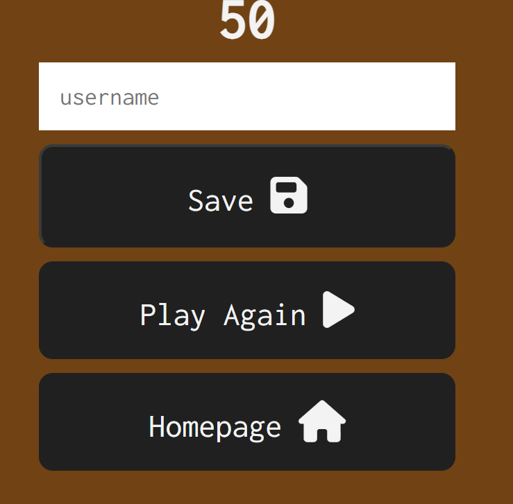
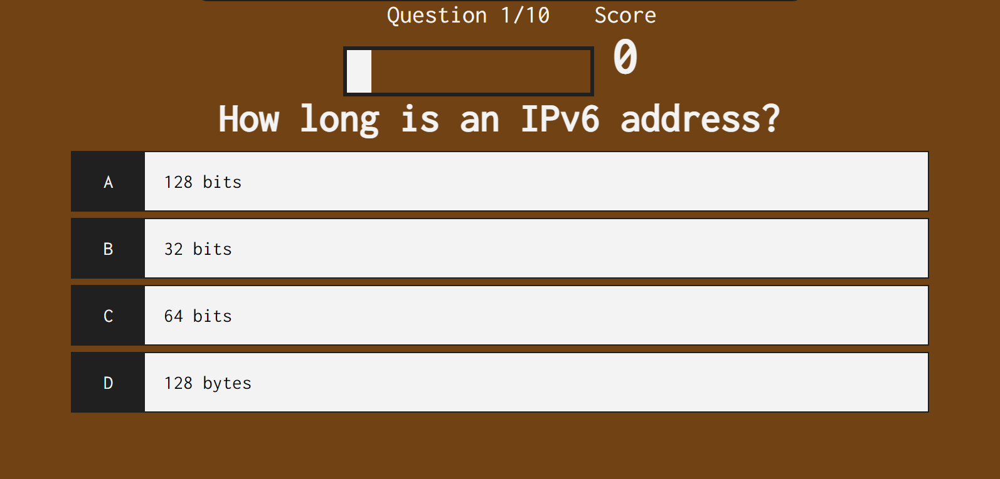
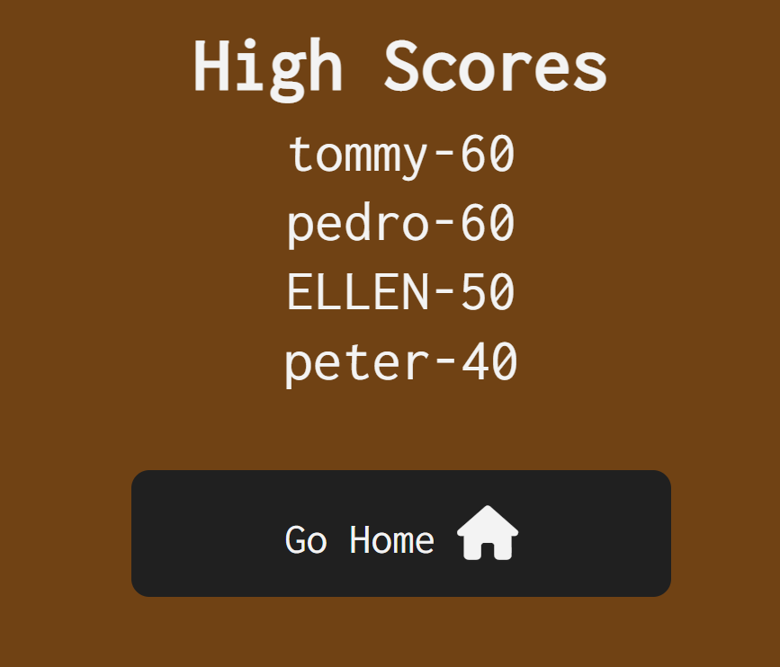
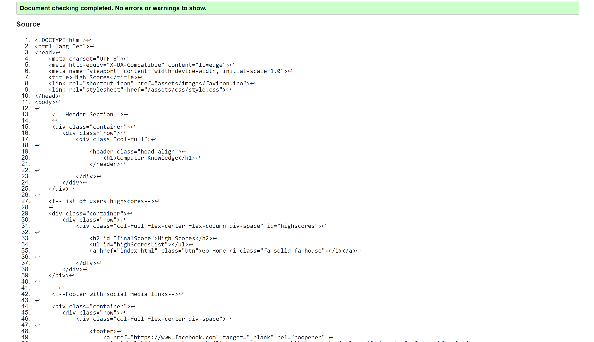

# **Computer Knowledge**

Computer Knowledge is website which offers a quiz to test your computer knowledge. The site is targeted towards anyone who wants to test there computer knowledge. The quiz pulls random questions from an api (https://opentdb.com/).

​
## Table of contents:
1. [**Site Overview**](#site-overview)
1. [**Planning stage**](#planning-stage)
    * [***Target Audiences***](#target-audiences)
    * [***User Stories***](#user-stories)
    * [***Site Aims***](#site-aims)
    * [***Wireframes***](#wireframes)
    * [***Color Scheme***](#color-scheme)
    * [***Typography***](#typography)
1. [**Features**](#features)
    * [**Buttons**](#buttons)
    * [**Footer**](#footer)
    * [**Quiz Questions**](#quiz)
    * [**Highscores**](#highscores)
1. [**Testing Phase**](#testing-phase)
1. [**Bugs**](#bugs)
1. [**Deployment**](#deployment)
1. [**Credits**](#credits)
   
## **Planning stage**
### **Target Audiences**

 - ​Looking to target kids and adults of all ages to test there computer knowledge.
 - someone wanting a quiz time waster with little to invest
 - Quiz enthusiast

### **User Stories** 

 - As a user i want the site to be easy to use with a colourful and welcoming interface.
 - As a user i want to be challenged on my knowledge.
 - As a user i want to be able to save my scores.
 - As a user i want to see the top 5 scores.
 
​
​
### **Site Aims**

1. Create a simple but engaging quiz game.
2. Minimise continued maintenance with externally sourced quiz questions.
3. Be engaging wnough to hold peoples attention. 

​
### **Color Scheme**

The color scheme implemented throughout the site is a mixture between:

- #f3f3f3 for h1 and h2.
- #f3f3f3 for footer font colour.
- rgb(32, 32, 32) for the heading background.
- rgb(32, 32, 32) for footer background colour.
- rgb(112,66,20) for the body.
- #f3f3f3 for the text in the button.
- rgb(32, 32, 32) for the background in the button.
- #f3f3f3 for the hover on the button.
- #f3f3f3 for the background in the choice container.
- rgb(32, 32, 32) for the text in the choice container.
- #f3f3f3 for the letter on the choices.
- rgb(32, 32, 32) for the background of the letter choice.

All colours have been implemented to compliment each other and be aesthetically pleasing. I tried to keep to a theme of using #f3f3f3 and rgb(32, 32, 32).
 
## **Typography**

- I kept it simple and consistent with one text Inconsolata. Its applied throughout all my pages and is nice and easy to read.

## **Features**
## **Buttons**

- 2 buttons on the index.html page one to start the game and the other to view the users top 5 highscores.
 

- Once you finish the quiz you have 3 buttons
- First one you can save your name and score but to save the data you first have to enter your name or you cannot press the button.
- Second will let you play the quiz again.
- The third one will return you to the homepage.
  
   

- On the highscores page you have one button once the highscores are displayed which will bring you back to the homepage.

## **Footer**

- The footer is located on 3 pages the highscores page, homepage and endgame page.
- It has 3 social media links Facebook, Instagram, Twitter.
- They are centered in the middle of the screen and aligned with flex with a flex direction of column.

## **Quiz Questions**

- There are 4 choices in the quiz questions A, B, C and D.
- The questions are put into the quiz using an api on (https://opentdb.com/).
- Above the questions it tells you which question your on out of 10 and as you progress through the questions there is a loader bar to let you know how far you have gone.
- To the right of the question your on is the score the user has.
- The user will get 10 points for every question they get right.
- Everytime you select a question you will get a sweet alert which will tell you if you got the question right or wrong.

## **Highscores**

- The top 5 highscores are displayed on the highscores page.
- They are stored in local storage.

## **Testing Phase**
- I tested all 4 html documents using the W3C validator
- Index.html
  

  - Endgame.html

  - Game.html

​

  - Highscores.html
    

​

  - CSS
  - All the css is tested on the jigsaw website.

​

Testing functionality

 - I tested all the buttons worked correctly by pressing each one and making sure they returned the correct outcome.
 - I tested the quiz itself by selecting each answer and making sure i was getting the correct outcome e.g the correct answer returned it correct and returned the sweet alert with adding 10 points for the correct answer.
 - I also made sure once you selected the wrong answer that you got the correct sweet alert and no bonus was added for that.
 - I also checked that by clicking the buttons numerous times that we still go the right outcome and the app did not break.
 - I made sure that at the end of the game you could save the users score and that before they submit there score they had to enter a name.
 - I also tested the highscores page to make sure what i was submitting was returning the correct data to local storage.
 - I checked that all links open into a new tab and they brought me to the correct site.

## **Bugs**

Questions

 - Sometimes the api would generate a question and there would be still some html code in the question.
 - To fix this i realised i had .innerText in the javascript so i changed it to .innerHTML and that fixed the bug.

Loader 

 - When i put the loader into the site it would load but would not go away.
 - To fix this i realised i had my id in the wrong place and i had my add and hide loader in a seperate function so i moved them to start game function and it fixed this.

Highscore

 - Once i saved the users highscores it would return undefined.
 - To fix this i seen in the endgame.js i had score.innerHTML and once i removed innerHTML it returned the correct score.

Sweet Alert

 - I tried to add a sweet alert i found on google and once i put the code into javascript and css it would not show up.
 - To fix this i found another one which you put a script tag into your html file and it fixed this.

Responsiveness 

 - Whenever i viewed the site in dev tools the responsiveness was not right as it got smaller.
 - To fix this i inserted most my content on each html page into 3 divs all with the same css code to keep it all in line.

​
***
## **Deployment**
I deployed the page on GitHub pages via the following procedure: -
​
1. From the project's [repository](pageurl), go to the **Settings** tab.
2. From the left-hand menu, select the **Pages** tab.
3. Under the **Source** section, select the **Main** branch from the drop-down menu and click **Save**.
4. A message will be displayed to indicate a successful deployment to GitHub pages and provide the live link.
​
You can find the live site via the following URL - [Computer Knowledge](https://peterq93.github.io/quiz/)
***
​

​
## **Credits**

Loader 
 - I picked the loader from a w3 schools page (https://www.w3schools.com/howto/howto_css_loader.asp).

Javascript 
- I looked at two courses on youtube for ideas about how to go about building the quiz with javascript.
- James Q Quick
(https://www.youtube.com/watch?v=u98ROZjBWy8&list=PLDlWc9AfQBfZIkdVaOQXi1tizJeNJipEx)
- Brian Design
(https://www.youtube.com/watch?v=f4fB9Xg2JEY&t=2745s)

Sweet Alert
- I found a good sweet alert on stack overflow in one of the comments.
(https://stackoverflow.com/questions/51579801/how-to-show-sweetalert-in-javascript).

​
​